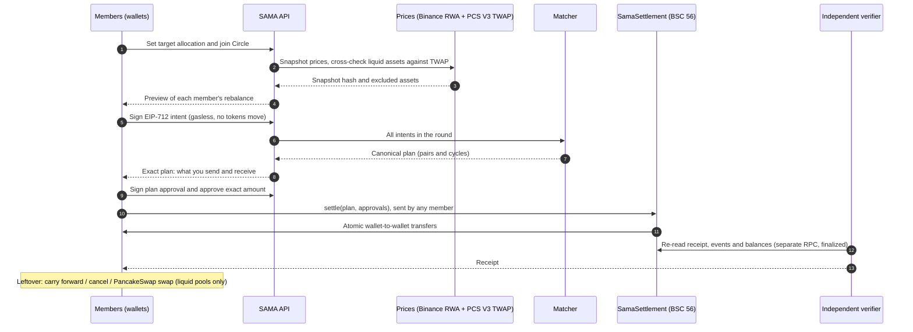
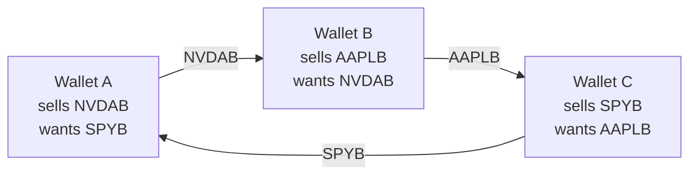
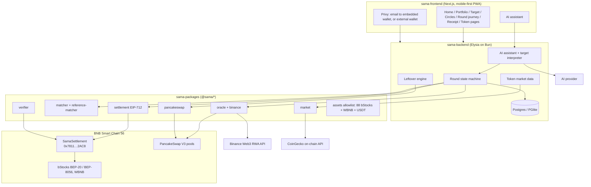

# SAMA 
Find the other side of your rebalance: wallet-to-wallet matching for tokenized stocks on BNB Chain.

## SAMA in 30 seconds

**Every day, people pay a pool to trade tokenized stocks with each other without knowing it.** In NVDAB's main pool, 16,004 buys and 15,251 sells cleared in one day. SAMA finds the wallets on the other side of your rebalance and settles with them directly: one signed plan, one atomic transaction, no pool fee, no spread, no price impact, and no custody.

- **It sees what order books can't.** A min-cost circulation matcher finds pairs *and* rings of three or more wallets, then a single contract call settles every leg or none.
- **It is live on BNB Chain mainnet.** The settlement contract is deployed at `0x7811…2AC8`, source-verified on BscScan and Sourcify, and it serves all 88 bStocks plus WBNB and USDT. The first live mainnet rounds are being run with real wallets and real bStocks, and each one appears on the public proof page with its independent verification.
<!-- After the first real round settles, replace the sentence above starting "The first live mainnet rounds" with:
- **It has settled on mainnet.** The first live round settled <N> wallets in one transaction (0x…), verified independently from chain data.
-->

- **It is built for real people.** Sign in with email, set a target in plain words, and let an AI assistant read your wallet and propose a plan. Nothing moves until you approve the exact transfers, with every signature explained in plain language.

## What is already working

- **A three-wallet ring, settled end to end.** Three wallets rotating NVDAB → SPYB → AAPLB, a trade no two of them could make alone, run through the full product API on a fork of BNB Chain mainnet: real bStocks, real Binance prices, real PancakeSwap TWAPs and the deployed `SamaSettlement`. The matcher finds the ring, all three legs settle in one atomic transaction, the independent verifier passes, and the round is published on the proof page. A built-in demo replays the same journey without a wallet in under two minutes.
- **A real AI agent, with a human in charge.** The assistant asks, reads the user's own data through server tools, answers with live token cards, and proposes a target that the user confirms with one tap. It cannot move funds or save anything by itself.
- **Public, checkable proof.** A proof page shows the deployment, the verified source and every settled round with its independent verifier checks, so nobody has to take SAMA's word for it.
- **A full consumer app.** Email sign-in with an embedded wallet, a portfolio that reads balances straight from the chain, a live market page for every one of the 90 assets, Circles, a monthly returns calendar, and one-tap BNB to WBNB conversion, in English and Bahasa Indonesia, on phone or desktop.
- **Production-grade foundations.** 33 contract unit tests with fuzzing, 22 mainnet-fork tests on real bStocks, an independent reference matcher that checks the production solver, and server-side safety caps while the contract awaits an audit.

## What is new here

| | Typical DEX or order book | SAMA |
|---|---|---|
| Who you trade with | The pool, at the pool's price | Other wallets heading the opposite way, at one shared snapshot price |
| Multi-party trades | Pairwise only | Rings of three or more wallets, settled together |
| Cost of the matched part | Pool fee, spread and price impact on every leg | None. Transfers go wallet to wallet |
| Custody | Tokens sit in the pool | Never. The contract's balance is zero before and after every settlement |
| Failure mode | Partial fills, slippage | All or nothing: the whole plan settles or reverts |
| Proof | A swap receipt | An independent verifier re-reads every settlement on a second RPC |
| AI | None, or an agent that trades for you | An agent that only reads and proposes; you approve every change |

---

## Problem Statement

Tokenized US stocks (bStocks such as NVDAB, TSLAB, AAPLB and SPYB) now trade on BNB Chain, but their liquidity is thin and uneven. In a snapshot of all 88 bStocks on 7 October 2026, only 37 had 100 or more trades in a day, 24 had a pool with no trades at all that day, and 3 had no pool anywhere. Rebalancing a small portfolio means paying a pool fee, spread and price impact on every leg, and in the thinner pools even a $200 order moves the price.

Yet the flow is two-sided. In NVDAB's main pool, 16,004 buys and 15,251 sells went through in a single 24-hour window. Each of those trades paid the pool, even though much of the buying and selling could have cancelled out directly between the wallets involved. Across whole portfolios, complementary needs can also form rings (A wants what B holds, B wants what C holds, C wants what A holds) that no pairwise venue or order book can match.

The people hit hardest are small self-custody investors, the users tokenized stocks are meant to open markets to. When every rebalance leaks value to a pool, holding a diversified tokenized portfolio stops making sense.

## Solution

SAMA groups wallets into **Circles** (a community, a Telegram investment group, friends) that rebalance the same set of assets on a schedule: 88 bStocks, WBNB and USDT. Each round:

1. Every member sets a target allocation: from a preset, per-token percentages, a sentence ("cut NVDAB to 20%, keep 10% in USDT"), or a proposal from SAMA's AI assistant that the member reviews and saves.
2. SAMA takes one price snapshot pinned to a block. Prices come from the Binance Web3 RWA API (Binance spot for WBNB), and every asset with a liquid PancakeSwap V3 pool is cross-checked against a 30-minute TWAP. It then computes each member's rebalance. Members sign an EIP-712 intent, which is free and moves no tokens.
3. A min-cost circulation matcher finds every part of those rebalances that cancels out, including cycles of three or more wallets that pairwise venues cannot see.
4. Each member approves the exact plan, and `SamaSettlement` executes every transfer **wallet to wallet in one atomic transaction**. The contract never holds funds, and either every leg settles or none does.
5. An independent verifier re-reads the settlement from a separate RPC after finality and issues a receipt linked to BscScan.
6. Whatever didn't match can be carried to the next round, cancelled, or, where the asset has a liquid PancakeSwap V3 pool, swapped from the user's own wallet, only when the swap fits the user's cost cap and the NYSE is open.

Matched volume pays no pool fee, spread or price impact; only network gas applies. The settlement contract is source-verified on BscScan and Sourcify, and plans are capped at $500 while it is unaudited. The app is mobile-first and bilingual. Sign-in is by email or wallet through Privy. Each token has a live market page, and an AI assistant reads the user's own data and proposes actions they confirm. When nothing matches, the app says so plainly and offers a next step.

---

## Project Detail

### What SAMA is

**SAMA** means both *"the same"* and *"together"* in Indonesian. Two wallets holding the same stock but moving in opposite directions are paired and trade directly, together.

SAMA is a **portfolio-intent matching network for bStocks on BNB Chain**. It does not replace the DEX. It sits in front of it and removes the part of the flow that never needed to touch a pool.

### How a round works

### Why cycles matter

A pairwise venue sees three wallets that each want something nobody directly offers. SAMA sees a ring and settles all three legs in one transaction:

No pool is touched and nobody pays price impact. The plan either settles fully or reverts.

### Architecture

### Key components

| Component | What it does |
|---|---|
| **`SamaSettlement`** (Solidity, Foundry) | Non-custodial atomic settlement of a signed plan. EIP-712 domain `"Sama"`, unordered nonces, exact approvals, no owner, no upgrade, no fee. Its token balance stays zero. Covered by 33 unit tests, including a 512-run fuzz test of conservation and exact net balance changes, and 22 mainnet-fork tests that move real bStocks with `transferFrom`. Source verified on BscScan and Sourcify. |
| **Matcher** | Min-cost circulation on a $0.01 lot grid. It is deterministic and finds pairwise matches and multi-wallet cycles. A separate reference matcher checks its output in tests. |
| **Price snapshot** | Binance Web3 RWA API is the primary price source (Binance spot for WBNB). For assets with a liquid pool, a PancakeSwap V3 30-minute TWAP pinned to the snapshot block is the on-chain guard. An asset is excluded, with a visible reason, if Binance marks it blocked, its price is stale during the session, its price disagrees with the on-chain multiplier, or it diverges from the TWAP by more than 100 bps (300 bps when the market is closed). |
| **BEP-8056 aware** | bStocks carry a UI multiplier (dividends, splits). All matching uses raw balances. The multiplier is read on-chain at the snapshot block, and an asset is excluded if the multiplier changes while the round is open. |
| **Independent verifier** | After finality it re-reads the receipt, calldata, events and balances through a different RPC host, then issues a receipt that links to BscScan. |
| **Leftover engine** | Compares the PancakeSwap V3 all-in cost (gas + fee + impact, quoted with QuoterV2) with the user's cost cap. The swap runs from the user's own wallet, only for assets with a liquid PancakeSwap V3 pool, and it waits when the NYSE is closed. |
| **AI assistant** | A tool-using agent in the app. It reads the user's own wallet, target, prices, Circles and activity through 12 server tools: 9 that only read and 3 that propose. A proposal (a target, joining a Circle, opening a page) is a button the user presses; nothing changes otherwise, and a proposed target is validated against the live wallet first. Every number it states comes from a tool call. Answers show live token cards, and conversations are saved per wallet. |
| **AI target interpreter** | Turns a sentence (English or Bahasa Indonesia) into structured operations. The model never produces addresses, prices or amounts. Deterministic code resolves every number against the allowlist, and lookalike tickers are rejected. |
| **Token market data** | Each token has a page with its price chart, market cap, 24-hour volume, liquidity and the latest trades from every wallet, read from CoinGecko's on-chain API behind one shared server cache. Only allowlisted tokens are served. |

### Assets

88 bStocks, WBNB and USDT, grouped by how much liquidity and how many holders stand behind each token:

- **18 bStocks, plus WBNB, with a liquid PancakeSwap V3 pool:** prices are cross-checked against an on-chain TWAP, and leftovers can be swapped.
- **11 bStocks with at least 1,000 holders:** Binance price only, matching only.
- **59 bStocks with few holders, or leveraged ETFs:** matching only, with a UI warning.

WBNB is how BNB joins a rebalance: settlement moves tokens only, and the app converts BNB to WBNB and back in one transaction. Liquidity follows these groups. On 7 October 2026 every one of the 18 liquid bStocks had 100 or more trades in a day, while most of the 59 thin ones had few or none. The thinner groups are exactly where peer matching helps most, because the pool is not a realistic option there.

### Trust model

- **Non-custodial:** tokens move wallet to wallet. The contract never holds them.
- **Exact consent:** users sign an intent, then the exact plan, then an exact-amount approval. The UI shows each signature in plain language ("You send 0.4 NVDAB to Member 2").
- **Atomic:** a plan settles in full or not at all.
- **Verifiable:** the contract source is verified, and every settlement is re-checked independently and produces a receipt with BscScan links.
- **Human in the loop:** the AI assistant only reads and proposes. Every change is a button the user presses.
- **Honest outcomes:** "Nothing matched this round, no tokens moved" is a valid result, and the app always offers a next step.
- **Safety caps:** while the contract is unaudited, the server refuses any plan that matches more than $500.

### Tech stack

- **Chain:** BNB Smart Chain mainnet (56), bStocks (BEP-20 / BEP-8056), WBNB, USDT, PancakeSwap V3 (SmartRouter, QuoterV2)
- **Contract:** Solidity 0.8.33, OpenZeppelin 5, Foundry (unit, fuzz and mainnet-fork tests)
- **Backend:** Bun + Elysia, Postgres or embedded PGlite (production runs PGlite), viem, Binance Web3 RWA API (HMAC-signed, server-only), CoinGecko on-chain API
- **Frontend:** Next.js 16, React 19, Privy auth, mobile-first PWA, light/dark mode, ID/EN
- **AI:** the assistant runs on any OpenAI-compatible model with tool calling (configurable gateway, Groq supported). The target interpreter uses Claude or Groq with structured output and a deterministic resolver.

## Contract Address
`0x7811a30D29d6c2Ca95Aeb4EE9D896cE44Cb72AC8`

---

### Team
**NGDKLabs**
